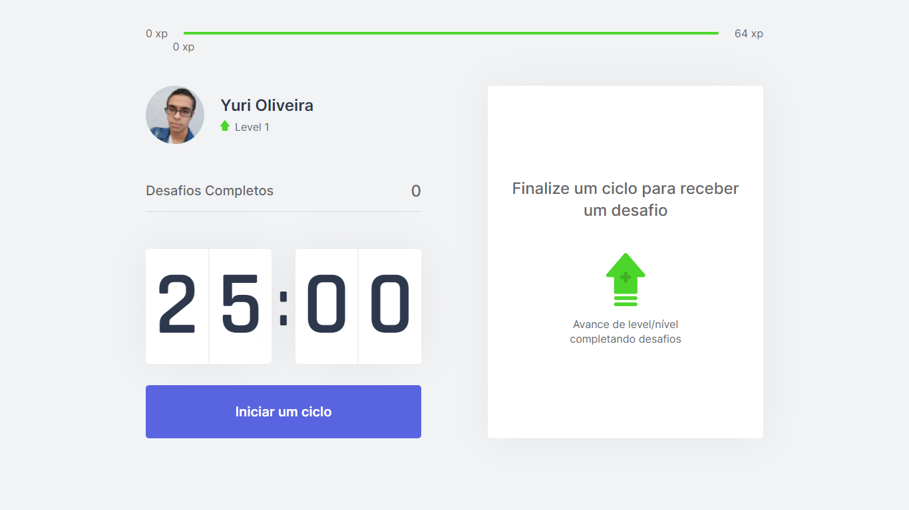

<h1 align="center">
    <br>
        
    <br>
    <br>
        MoveIt 
</h1>

<div>

<p align="center">
    <a href="https://www.linkedin.com/in/yuri-silva99/" target="_blank">
        
    </a>
    <a href="#">
        
    </a>
    <a href="#">
        
    </a>
    <a href="#">
        
    </a>
</p>

</div>

<p align="center">
    
</p>

## Table of Contents

<!--ts-->
   * [About](#about)
   * [Features](#features)
   * [Revised Concepts](#revised-concepts)
   * [Get Started](#get-started)
   * [Technologies](#technologies)
   * [Translations](#translations)
   * [License](#license)
<!--te-->

## About

<div>
    <p align="center">
        MoveIt é um projeto desenvolvido durante a 4ª edição da Rocketseat's Next Level Week. Esta semana criamos um aplicativo web utilizando o React, após 25 minutos de estudo, ele nos envia um alerta com alguns exercícios para o corpo e os olhos, com avanço de nível a cada desafio realizado.
    </p>
</div>

## Features

- ⏲️ Start a 25-minute study period.
- ❌ Abandon study periods.
- 🔊 Notification and audible warning when the period ends.
- 👀 New challenges to exercise your eyes and body.
- 🎮 User earns XP for every challenge completed.
- 🆙 Stay motivated after each level as you advance.

## Revised Concepts

- ❌ Blocking routes for users unregistered.
- 🌐 Global Variables.

## Get Started
<b> You must have already installed </b>
- <a href="https://nodejs.org/en/download/"> Node.JS </a>
- Package manager (NPM or Yarn)
- Postgresql

<b> Recommendations </b>

<ul>
    <li> It is recommended that you have installed Google Chrome </li>
    <li> I recommend using VSCode as a development IDE </li>
</ul>

``` bash
## Clone the repository
$ git clone https://github.com/Yuri-stack/Launchstore.git

## Access the project folder at the command prompt
$ cd launchstore

## Install the dependencies
yarn install
or
$ npm install

## Create the database
$ run the file diagram.sql

## Getting Started
$ yarn start
or
$ npm run start
```

## Technologies

- [Expo](https://expo.io/)
- [Node.js](https://nodejs.org/en/)
- [React](https://pt-br.reactjs.org/)
- [React Native](https://reactnative.dev/)
- [Javascript](https://www.javascript.com/)
- [Nunjucks](https://mozilla.github.io/nunjucks/)
- [TypeScript](https://www.typescriptlang.org/)

## Translations
<ul>
    <li><a href="https://github.com/Yuri-stack/NLW4_MoveIt/blob/main/ReadMe.md">Original</a></li>
    <li><a href="github/translate/ReadMe.md">Portuguese</a></li>
</ul>

## License

Released in 2021. 
This project is under the [MIT license](https://github.com/Yuri-stack/ReadMe/blob/main/LICENSE).

Made with love by [Yuri Oliveira](https://github.com/Yuri-stack) 🚀.